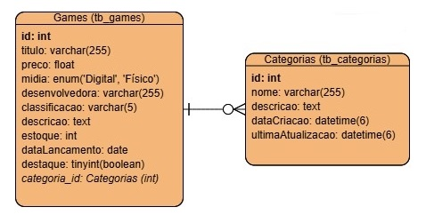

# 🎮 R.SpacePlay - Uma Loja de Jogos

Projeto desenvolvido durante o **Bootcamp da Generation Brasil - Bloco 2**, com foco em construção de APIs utilizando o framework **Nest.js** e banco de dados relacional **MySQL**.


## 📚 Sobre o Projeto

O **R.SpacePlay** é uma aplicação back-end que simula uma loja virtual de jogos. Nele, é possível cadastrar, editar, listar, buscar e deletar **jogos** e suas respectivas **categorias**. O projeto adota boas práticas de desenvolvimento, validação de dados e arquitetura em camadas com NestJS.


## 🚀 Tecnologias Utilizadas

- [Nest.js](https://nestjs.com/)
- [TypeORM](https://typeorm.io/)
- [MySQL](https://www.mysql.com/)
- [Node.js](https://nodejs.org/)
- TypeScript
- Insomnia (para testes)


## 🧠 Funcionalidades e EndPoints

### 🔹 Categorias
- `GET /categorias` → Listar todas
- `GET /categorias/:id` → Buscar por ID
- `GET /categorias/:nome` → Buscar por nome
- `POST /categorias` → Criar nova categoria
- `PUT /categorias` → Atualizar categoria existente
- `DELETE /categorias/:id` → Deletar uma categoria

### 🔹 Games
- `GET /games` → Listar todos os jogos
- `GET /games/:id` → Buscar por ID
- `GET /games/titulo/:titulo` → Buscar por título
- `GET /games/destaques` → Listar jogos em destaque
- `POST /games` → Criar novo jogo
- `PUT /games` → Atualizar jogo existente
- `DELETE /games/:id` → Deletar um jogo


## 🧾 Entidades Principais

### 🎮 `Games`
- `id` (PK)
- `titulo`
- `preco`
- `midia`
- `classificacao`
- `descricao`
- `estoque`
- `dataLancamento`
- `destaque`
- `desenvolvedora`
- `categoria_id` (FK)

### 🗂️ `Categorias`
- `id` (PK)
- `nome`
- `descricao`
- `dataCriacao`
- `ultimaAtualizacao`


## 🛠️ Como Rodar o Projeto

1. **Clone o repositório:**

```bash
git clone https://github.com/seuusuario/r-spaceplay.git
cd r-spaceplay
```

2. **Instale as dependências:**

```bash
npm install
```

3. **Configure o banco de dados MySQL:**

```sql
CREATE DATABASE db_gamestore;
```
* O arquivo `db_gamestore.sql` possui dados pré-prontos que podem ser cadastrados para testes.

4. **Ajuste o arquivo `app.module.ts` se necessário:**

```ts
TypeOrmModule.forRoot({
  type: 'mysql',
  host: 'localhost',
  port: 3306,
  username: 'root',
  password: 'root',
  database: 'db_gamestore',
  synchronize: true,
  logging: true,
});
```

5. **Inicie o servidor:**

```bash
npm run start:dev
```
- A aplicação rodará em: http://localhost:4000

## 🔍 Testes

Recomenda-se o uso de ferramentas como Insomnia ou Postman para realizar os testes das rotas descritas acima.


## 🗺️ Modelo DER (Diagrama Entidade-Relacionamento)



## 👨‍💻 Desenvolvedor

**Lucas Alves Pinheiro**  
Desenvolvedor Full Stack  
🔗 [linkedin.com/in/lucasalvespinheiro](https://linkedin.com/in/lucasalvespinheiro)


## 🎓 Instituição

Projeto desenvolvido durante o **Bootcamp da Generation Brasil**, no  
**Bloco 2 – Back-end com NestJS**.